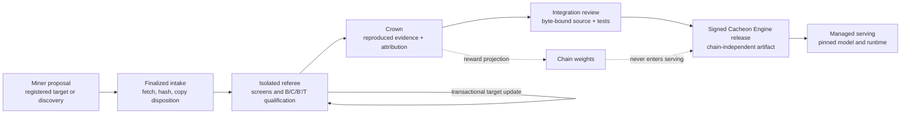

At the highest level, Cacheon is two systems joined by a controlled promotion
boundary. The market system deliberately separates its subnet control plane
from its hostile-code referee, so operators interact with three surfaces:

- **Cacheon Engine** is a chain-independent inference-acceleration distribution built on a pinned SGLang substrate.
- **The subnet** owns finalized proposal ordering, attribution, settlement, and weight publication.
- **The referee** screens and measures hostile proposals against validator-owned policy and evidence authority.

The referee may execute hostile miner artifacts. The engine never serves them
directly. A measured win becomes a **crown**; a crown becomes shippable only
after review, integration that preserves the crowned selected payload,
deterministic packaging outside that selected closure, and release signing.

This split is the primary architectural constraint. It prevents economic state, mutable miner hosting, and unreviewed proposal code from becoming production dependencies.

## The core boundaries

Cacheon uses two different units on purpose.

| Boundary    | Unit                                                                   | Why it exists                                                                                                   |
| ----------- | ---------------------------------------------------------------------- | --------------------------------------------------------------------------------------------------------------- |
| Execution   | A complete isolated engine                                             | Candidate Python, native code, engine construction, and serving behavior remain outside the trusted controller. |
| Attribution | One registered slot, atomic target, or reviewed discovery contribution | A miner proposes only the smallest attributable delta; the validator supplies the incumbent stack around it.    |

A candidate can therefore improve an incumbent stack without receiving or repackaging the incumbent contributors' bundles. For example, a new 3% delta can be tested on top of an existing 7% improvement while attribution remains attached only to the new delta.

Execution isolation does not imply whole-engine economic ownership. Conversely, narrow economic identity does not require importing candidate code into the controller.

## Architectural objects

Four objects must remain distinct throughout the system:

1. A **proposal** is hostile input: a target-scoped delta or a fenced discovery prototype.
2. A **crown** is retained evidence that the proposal improved one registered arena and target.
3. An **integrated contribution** is reviewed Cacheon source that preserves the crowned selected payload and is bound to an immutable contribution identity.
4. An **engine release** is a signed artifact containing the pinned runtime, reviewed stack, model identity, native artifacts, policy inputs, SBOM, and provenance.

See [Product model](/docs/architecture/product-model) for the authority and lifecycle of each object.

## System map

| Area                | Responsibility                                                                                            | Principal implementation                                                                                                                                                                                                                                                                          |
| ------------------- | --------------------------------------------------------------------------------------------------------- | ------------------------------------------------------------------------------------------------------------------------------------------------------------------------------------------------------------------------------------------------------------------------------------------------- |
| Submission ABI      | Stable typed replacement boundaries and validator-owned correctness contracts                             | [`slots.py`](https://github.com/latent-to/optima/blob/main/optima/slots.py), [`tensor_spec.py`](https://github.com/latent-to/optima/blob/main/optima/tensor_spec.py)                                                                                                                              |
| Economic identity   | Registered singleton and atomic targets, overlap, displacement, and composition policy                    | [`target_catalog.py`](https://github.com/latent-to/optima/blob/main/optima/target_catalog.py)                                                                                                                                                                                                     |
| Runtime integration | Version-pinned SGLang chokepoints, bootstrap, dispatch, and fallback                                      | [`seams.py`](https://github.com/latent-to/optima/blob/main/optima/seams.py), [`seam.py`](https://github.com/latent-to/optima/blob/main/optima/seam.py), [`dispatch.py`](https://github.com/latent-to/optima/blob/main/optima/dispatch.py)                                                         |
| Stack identity      | Content-addressed evaluation and release manifests, exact marginal substitutions, rollback                | [`stack_manifest.py`](https://github.com/latent-to/optima/blob/main/optima/stack_manifest.py), [`stack_plan.py`](https://github.com/latent-to/optima/blob/main/optima/stack_plan.py)                                                                                                              |
| Engine construction | Deterministic source closure, namespacing, native build identity, isolated OCI execution                  | [`engine_tree.py`](https://github.com/latent-to/optima/blob/main/optima/engine_tree.py), [`eval/engine_launch.py`](https://github.com/latent-to/optima/blob/main/optima/eval/engine_launch.py), [`eval/oci_backend.py`](https://github.com/latent-to/optima/blob/main/optima/eval/oci_backend.py) |
| Qualification       | Registered arena policy, staged screens, B/C/B′ timing, pristine T quality, retained evidence             | [`arena_service.py`](https://github.com/latent-to/optima/blob/main/optima/arena_service.py), [`eval/qualification_runner.py`](https://github.com/latent-to/optima/blob/main/optima/eval/qualification_runner.py)                                                                                  |
| Chain authority     | Finalized ordering, immutable publication, state transitions, settlement, and weight journal              | [`chain/intake.py`](https://github.com/latent-to/optima/blob/main/optima/chain/intake.py), [`settlement.py`](https://github.com/latent-to/optima/blob/main/optima/settlement.py), [`economics.py`](https://github.com/latent-to/optima/blob/main/optima/economics.py)                             |
| Product release     | Integration review, model sealing, signed artifacts, reproducible container identity, fail-closed serving | [`release.py`](https://github.com/latent-to/optima/blob/main/optima/release.py), [`release_host.py`](https://github.com/latent-to/optima/blob/main/optima/release_host.py), [`release_runtime.py`](https://github.com/latent-to/optima/blob/main/optima/release_runtime.py)                       |

## Trust model

The validator owns policy, identities, workloads, timing, references, output buffers, storage, and state transitions. Candidate code is never trusted to grade itself.

The production referee follows these rules:

- the controller never imports candidate Python or native extensions;
- every timed arm runs as a complete engine in a disposable, no-egress OCI session;
- the candidate engine cannot choose its incumbent, role, workload, target identity, or evidence schema;
- B, C, and B′ are timed under a sealed cohort authority;
- T is pristine, candidate-free, untimed, and used only for semantic quality;
- infrastructure failure or cohort drift produces `NO_DECISION`, not a loss or crown;
- settlement reopens retained evidence and requires two independent passing authorities.

The slot boundary adds a second layer of defense: the validator allocates the output and keeps every slot strictly upstream of sampling. See [Slot contract](/docs/architecture/slot-contract).

## Stack model

The referee, the product, and the semantic reference use separate manifests:

- `EvaluationStackManifest` may name hostile crowned proposal artifacts and is valid only inside isolated evaluation.
- `EngineReleaseManifest` accepts reviewed integrated contributions only and is the serving product identity.
- `ReferenceManifest` names pristine validator-owned semantic authority used for untimed quality grading.

All identities are canonical and content-addressed. A candidate arm is the incumbent evaluation stack with one registered target transition. A crown updates the evaluation stack transactionally; it does not mutate an engine release. See [Stacks and manifests](/docs/architecture/stacks).

## Data plane scope

Normal submissions optimize the inference data plane: kernels, quantized GEMMs, attention, MoE, collectives, communication overlap, KV-cache operations, graphs, fused blocks, and bounded execution-adjacent strategies.

The service control plane remains upstream of the competition boundary: HTTP and API behavior, authentication, tokenization, request admission, fleet orchestration, autoscaling, observability, and operational lifecycle management are not ordinary miner targets.

Work that cannot yet fit a registered target enters the fenced discovery lane. Discovery can earn a bounded reviewed bounty or be promoted into a new validator-owned target; it does not create an unbounded duplicate reward family.

## End-to-end flow

The authoritative path is:

1. finalized timelock commit-reveal intake;
2. hardened fetch, content re-hash, copy disposition, and immutable worker publication;
3. registered-arena static, build, ABI, graph, and abbreviated-serving screens;
4. sealed cohort qualification with B/C/B′ timing and pristine T quality;
5. independent reproduction of the exact candidate identity;
6. evidence reopening, conservative settlement, and transactional stack update;
7. journaled reward projection and weight publication;
8. independent integration review and signed engine release.

Local `verify`, `evaluate`, and `bench` commands are developer diagnostics. They do not mint production crown authority. See [Evaluation pipeline](/docs/architecture/pipeline) for the detailed state machine and [Releases](/docs/architecture/releases) for the ship boundary.

## Design acceptance tests

The architecture is preserving its product boundary when all of the following remain true:

- the latest signed engine can be rebuilt and served without chain access or miner hosting;
- every candidate is measured as one marginal substitution over the current stack;
- candidate code stays outside the trusted controller;
- a whole-system prototype cannot silently acquire a permanent whole-engine reward title;
- every shipped component resolves to reviewed Cacheon source and immutable attribution;
- changing the evaluation incumbent cannot mutate a signed release;
- shipping a reviewed release does not depend on chain availability.

## Further reading

- [Product model](/docs/architecture/product-model)
- [Stacks and manifests](/docs/architecture/stacks)
- [Evaluation pipeline](/docs/architecture/pipeline)
- [SGLang seam](/docs/architecture/seam)
- [Release architecture](/docs/architecture/releases)
- [Current state of record](/docs/reference/state-of-record)
- [Canonical product contract](https://github.com/latent-to/optima/blob/main/docs/PRODUCT_CONTRACT.md)
