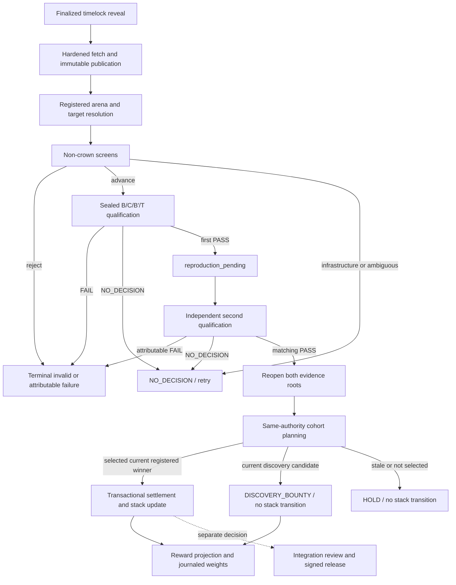

Cacheon has two evaluation paths with different authority:

- the **developer path** helps a miner build and debug a proposal;
- the **production referee path** can create retained qualification, crown, settlement, and reward state.

The developer commands intentionally reuse parts of the ABI and evaluation machinery, but their output is not production crown evidence.

## Developer path

```text
slots -> scan -> verify -> chain-package -> host -> chain-submit -> chain-status
```

| Step            | Purpose                                                                                              | Authority              |
| --------------- | ---------------------------------------------------------------------------------------------------- | ---------------------- |
| `slots`         | Inspect the live slot ABI                                                                            | Informational          |
| `scan`          | Run static bundle policy checks                                                                      | Diagnostic             |
| `verify`        | Check a single op/block against its trusted reference; collective slots use distributed verification | Diagnostic             |
| `chain-package` | Produce the deterministic hosted archive and content identity                                        | Submission preparation |
| HTTPS host      | Make the immutable archive available for validator fetch                                             | Transport only         |
| `chain-submit`  | Commit the proposal through timelock commit-reveal                                                   | Chain intake           |
| `chain-status`  | Inspect submission state                                                                             | Informational          |

Local measurements are useful for iteration. They do not select a production arena authority, reserve a finalized cohort position, retain authenticated B/C/B′/T evidence, or satisfy independent reproduction.

## Production path at a glance



## 1. Finalized intake

Submissions enter through native timelock commit-reveal. The validator acts only on finalized chain order. Finalized block position and commitment identity establish priority; evaluator network arrival does not.

`FinalizedIntakeStore` persists production authority in SQLite. It records finalized observations, fetch state, copy disposition, screen receipts, cohort reservations, qualification attempts, evidence roots, reproduction state, stack transitions, settlement, and weight-publication state.

State transitions are typed and transactional. The validator does not reconstruct production authority from console output, mutable directories, or a legacy JSON ledger.

Principal code: [`chain/intake.py`](https://github.com/latent-to/cacheon/blob/main/optima/chain/intake.py) and [`chain/validator_loop.py`](https://github.com/latent-to/cacheon/blob/main/optima/chain/validator_loop.py).

## 2. Hardened fetch and publication

The submitted URL is transport, not identity. The fetch path:

1. applies the validator's HTTPS and network policy;
2. writes into validator-private bounded storage;
3. recomputes the deterministic bundle content hash;
4. compares it with committed identity;
5. derives the copy/provenance disposition;
6. publishes the complete artifact into an immutable, hash-addressed worker namespace;
7. reopens the publication before any screen or launch consumes it.

Partial downloads, path tricks, changed content, duplicate/malformed archives, and publication mismatches fail closed. Candidate workers receive only immutable publications; they do not fetch miner URLs themselves.

Principal code: [`chain/fetch.py`](https://github.com/latent-to/cacheon/blob/main/optima/chain/fetch.py), [`chain/payload.py`](https://github.com/latent-to/cacheon/blob/main/optima/chain/payload.py), and [`bundle_hash.py`](https://github.com/latent-to/cacheon/blob/main/optima/bundle_hash.py).

## 3. Arena and target resolution

An `ArenaServiceRegistry` maps a public arena identifier to a closed
`ArenaService`. Its manifest directly binds:

- runtime, base-engine, validator-overlay, worker, model, architecture, GPU,
  and topology identities;
- the decode/long-prefill workload mixture and prompt-seed scheme;
- non-crown screen policy;
- queue depth/age, cohort size, screen/qualification concurrency, and retry policy;
- the qualification-policy digest; and
- the reviewed provider implementation digest.

The target catalog, incumbent and candidate stacks, graph/engine settings,
calibration, reference, evidence, and quality identities are closed later by
the promoted candidate bindings and the provider-created typed qualification
plan. `ArenaService` checks the plan's policy digest and finalized reservation
order; it does not pretend all of that authority is a field of the service
manifest itself.

The proposal is resolved against the exact target catalog snapshot. A registered candidate must match its target members and permitted features. Cross-cutting unregistered work is routed through the discovery lane.

The command-line `chain-validate` loop can perform intake alone. Full production qualification requires the operator to inject a real `ArenaServiceRegistry` and select `--arena-id`; the repository does not manufacture a production arena provider from implicit defaults.

Principal code: [`arena_service.py`](https://github.com/latent-to/cacheon/blob/main/optima/arena_service.py), [`target_catalog.py`](https://github.com/latent-to/cacheon/blob/main/optima/target_catalog.py), and [`stack_plan.py`](https://github.com/latent-to/cacheon/blob/main/optima/stack_plan.py).

## 4. Non-crown screens

Expensive full-engine qualification is reserved for plausible candidates. The registered arena applies a fixed sequence of non-crownable screens:

1. static policy and manifest resolution;
2. deterministic source closure and build planning;
3. typed ABI correctness, including distributed verification for collectives;
4. graphs-on capture and dynamic-input replay;
5. abbreviated serving on a small registered workload.

Screens can reject invalid work or advance a promising candidate. They cannot crown it. Infrastructure errors and measurements too ambiguous for an attributable rejection remain retryable rather than being converted into a loss.

## 5. Cohort authority

At an evaluation boundary, the validator freezes:

- one incumbent `EvaluationStackManifest` digest;
- a finalized chain-ordered set of candidate reservations;
- one registered arena and target-catalog context;
- deterministic candidate order derived from committed authority;
- workload, prompt, seed, role, topology, calibration, and evidence policy.

Each candidate stack is the frozen incumbent with exactly one registered target delta. B and B′ independently materialize the exact incumbent. This prevents background stack updates from changing the comparison midway through a cohort.

The evaluator may amortize B/B′ and one pristine reference lifetime across several candidates, but the retained evidence still binds each C to its exact delta and causal authority.

Principal code: [`eval/qualification_intake.py`](https://github.com/latent-to/cacheon/blob/main/optima/eval/qualification_intake.py) and [`stack_plan.py`](https://github.com/latent-to/cacheon/blob/main/optima/stack_plan.py).

## 6. B/C/B′/T qualification

The authoritative bracket has four logical arms.

| Arm | Stack                                  | Timed? | Purpose                                          |
| --- | -------------------------------------- | -----: | ------------------------------------------------ |
| B   | Exact frozen incumbent                 |    Yes | Opening performance baseline                     |
| C   | Incumbent plus one exact target delta  |    Yes | Candidate measurement and sealed trajectory      |
| B′  | Independently launched exact incumbent |    Yes | Closing bookend and drift detection              |
| T   | Pristine candidate-free reference      |     No | Teacher-forced semantic quality and hidden tasks |

Native build and timed execution use separate containers. Before a runtime arm
starts, a disposable, no-GPU/no-network prebuild OCI parses the materialized
tree, invokes only registered build patchers, and emits a sealed native
publication. Each complete B/C/B′ runtime OCI then mounts that reopened
publication read-only. Candidate Python import, engine construction, and
execution occur only in the runtime's positively identified scheduler ranks;
runtime ranks may validate and load native products but may never compile or
repair them. Both stages use read-only roots, bounded mounts and protocols, and
host-owned cleanup; the trusted controller also owns timing.

For a direct-artifact row, prebuild executes the declared compiler factory only
inside a no-egress compiler child and publishes CUBIN rather than a host launcher.
After rank-local CUDA setup, the scheduler worker admits the exact CUBIN, binds its
complete driver-observed ABI to the declarative device plan by ordinal, and
materializes parameters and lifecycle storage in validator code. Qualification
requires per-member `aot_loaded`, `aot_invoked`, and normal `completed` coverage,
with no fallback receipt. See [Sealed direct artifacts](/docs/architecture/direct-artifacts).

After C is destroyed, T grades its sealed trajectory under a separate pristine lifetime. T never contains the candidate and does not compete on speed. Hidden reference work, quality policy, and selected prompt identity are bound into retained evidence.

The host pairs candidate throughput with the B/B′ bookend and applies the registered noise policy. Conceptually:

```text
paired_speedup = candidate_throughput / mean(B, B′)
required_bar   = 1 + max(margin_floor, noise_multiplier × measured_noise)
```

The exact registered policy, not this explanatory formula, is authoritative.

Principal code: [`eval/qualification.py`](https://github.com/latent-to/cacheon/blob/main/optima/eval/qualification.py), [`eval/qualification_runner.py`](https://github.com/latent-to/cacheon/blob/main/optima/eval/qualification_runner.py), and [`eval/oci_backend.py`](https://github.com/latent-to/cacheon/blob/main/optima/eval/oci_backend.py).

## 7. Verdict semantics

Qualification has three outcomes:

### `PASS`

The candidate clears the registered speed, quality, graph, evidence, and whole-stack requirements under a stable cohort authority. A first pass is retained as `reproduction_pending`; it does not settle alone.

### `FAIL`

Complete evidence attributes a policy failure to the candidate under a valid authority. Examples include incorrect output, a quality regression, or a stable speed result below the registered bar.

### `NO_DECISION`

The evaluator cannot make a valid attributable decision. Infrastructure failure, missing evidence, baseline drift, broken cohort invariants, or an invalid reference lifetime must not mint either a crown or a loss. The result retains a failure product and retry policy.

The distinction is load-bearing: treating evaluator failure as candidate failure would let infrastructure state rewrite economic truth.

### Worked lifecycle: retry, reproduce, settle

Consider a hypothetical candidate for one registered singleton target:

1. Intake fixes its finalized priority and immutable publication. It clears all five
   non-crown screens.
2. Its first bracket produces valid C work, but B′ drifts outside the frozen noise policy.
   The attempt is `NO_DECISION`. The proposal remains retryable; it has neither lost nor
   passed.
3. A later fresh authority reopens the same candidate identity. B/C/B′ are stable, T
   accepts the sealed trajectory, and the candidate clears the registered speed bar. The
   attempt becomes the first `PASS` and state becomes `reproduction_pending`.
4. A second independently selected authority repeats the exact reproduction identity and
   also passes. A pass against a newer incumbent or different target specification would
   not count as this reproduction.
5. Settlement reopens both evidence roots and makes the pair eligible for its
   same-authority cohort. If the candidate is selected as that cohort's current registered
   winner, settlement takes the lower accepted speedup, revalidates the live target
   transition, and atomically updates the evaluation stack; otherwise the pair is held.
6. If crowned, reward projection can now see the active claim. Product integration remains
   a separate review; no proposal bytes have entered a release merely because settlement
   completed.

The values and candidate in this walkthrough are illustrative. The state transitions and
failure semantics are the important part.

## 8. Independent reproduction

Settlement requires a second `PASS` for the exact same core reproduction
identity. `SettlementReproductionIdentity` contains exactly the arena digest,
target ID, selected-delta digest, hotkey, incumbent stack/tree digests, and
candidate stack/tree digests.

The settlement pair applies additional rules around that core identity. The two
qualification rows must match the same contribution, reservation, finalized
priority, manifests, members, and arm, while seven independence fields must all
differ: qualification authority, plan, attempt, report, selection commitment,
selection-secret commitment, and selection evidence. Authority therefore does
**not** belong inside the equal core identity; distinct authority is a separate
pair constraint.

An attributable second-attempt `FAIL` terminates the proposal. A
`NO_DECISION` follows the registered bounded retry/hold policy. In either case,
the retained first pass cannot update the incumbent by itself.

## 9. Settlement

Settlement reopens both recorded attempt references instead of trusting an in-memory
verdict. The references may live under the same content-addressed store root. It verifies:

- both reports are complete `PASS` results;
- all seven required authority, attempt, report, commitment, and selection digests are
  pairwise distinct across the two passes;
- reproduction identities match exactly;
- the incumbent and target transition are still current;
- target overlap, displacement, and composition remain valid;
- the requested stack update matches the measured candidate.

The planner leases one cohort whose rows share qualification authority and incumbent
state. Stale rows are held, and exactly one current registered winner is selected across
the remaining rows, including rows whose targets do not overlap. Other current pairs are
held as `conflict_lost` or `incumbent_advanced`; a stale pair is held as `stale_incumbent`.

For the selected winner, the conservative settled speedup is the lower accepted speedup
from the two passes. The stack transition and settlement evidence are committed
transactionally; a partial write cannot expose a half-updated incumbent.

Principal code: [`settlement.py`](https://github.com/latent-to/cacheon/blob/main/optima/settlement.py).

## 10. Reward projection and weights

Rewards attach to attributable target deltas, not to an argmax whole-engine winner. The registered policy converts relative improvement into credit using a saturating age-aware function:

```text
improvement_ppm = speedup_ppm - 1_000_000
credit          = floor(improvement_ppm × h / (h + a))
```

Here `h` is the configured half-life scale and `a` is contribution age. Atomic targets suppress overlapping singleton families according to the catalog. Discovery rewards come from a bounded, non-renewable pool or a reviewed promotion decision.

Weight publication is a separate journaled reconciliation. Intent, pending, held, released, and confirmed states are persisted and reopened. A chain SDK return value does not by itself prove inclusion. Production publication requires current-schema crown evidence; synthetic or legacy rows cannot authorize a real extrinsic.

The `set-weights` command requires explicit policy inputs, including half-life, discovery lifetime, discovery pool, and refresh behavior. Numeric choices are deployment policy and require calibration.

Principal code: [`economics.py`](https://github.com/latent-to/cacheon/blob/main/optima/economics.py), [`chain/weights.py`](https://github.com/latent-to/cacheon/blob/main/optima/chain/weights.py), and the [emissions policy](https://github.com/latent-to/cacheon/blob/main/docs/EMISSIONS_POLICY.md).

## 11. Integration and release

A settled crown may enter integration review, but serving remains a separate state machine. Reviewed source is promoted to an integrated contribution, assembled into an `EngineReleaseManifest`, rematerialized, signed, published, and verified without chain dependencies.

See [Release architecture](/docs/architecture/releases). The dated [State of record](/docs/reference/state-of-record) tracks implementation and validation
limits.

## Operational handoff checklist

Before treating an attempt as production authority, an operator or reviewer should be
able to reopen, rather than merely observe, each handoff:

- finalized chain position, commitment, fetched content identity, and immutable worker
  publication;
- registered arena, target catalog, incumbent manifest, candidate transition, and screen
  receipt;
- B/C/B′ launch identities and aggregate `SpeedWitness` rows, plus the retained
  graph/quality/pristine-T references and witnesses; raw B/C/B′ session/device frames are
  validated in-run but are not serialized into the attempt;
- frozen calibration and the exact policy that maps the retained witness/evidence products
  to the verdict;
- the seven digest-distinctness fields across primary and reproduction over one
  reproduction identity;
- transactional settlement events and resulting evaluation-stack digest;
- reward projection plus publication intent/status/chronology records; later readback
  vectors must be re-observed because the journal does not serialize them; and
- if shipping is proposed, the separate integration records and signed release identity.

Console output, a green local benchmark, one `PASS`, or a successful chain SDK return is
not a substitute for the corresponding reopenable product.
