A crown is evidence of measured contribution. A release is a reviewed, signed, chain-independent product artifact. Cacheon keeps those state machines separate so a hostile evaluation winner can never become serving code by reference alone.

```mermaid
flowchart LR
    C["Reproduced crown"] --> I["IntegrationReviewRecord"]
    I --> R["IntegratedContributionRef"]
    R --> M["EngineReleaseManifest"]
    M --> T["Materialized reviewed engine tree"]
    T --> P["Prepared release descriptor + artifacts"]
    P --> S["Ed25519 signature<br/>trusted by external expected key"]
    S --> U["Immutable release publication"]
    U --> O["Two reproducible registry builds"]
    O --> A["Authorized digest-pinned container"]
    A --> V["Fail-closed serving runtime"]
```



The current implementation contract is described here. Evidence about what has been exercised on real hardware is kept separately in [State of record](/docs/reference/state-of-record).

## Promotion from crown to source

`promote_integrated_contribution()` accepts a registered settlement candidate only after reopening its retained evidence. It verifies that:

- the crown names the exact proposal and target transition;
- primary and reproduction attempt references match settlement evidence;
- license, provenance, security, compatibility, and test evidence are present and pairwise distinct;
- the reviewed source preserves the crowned selected payload byte-for-byte;
- the reviewed source tree exists byte-for-byte at the full reviewed Git commit,
  while packaging outside the selected closure may be normalized;
- reviewer identity and immutable attribution are retained.

The result is an `IntegrationReviewRecord`. Its derived `IntegratedContributionRef` names reviewed source, target specification, selected payload, attribution, and the review record itself.

This is a source promotion, not an approval to keep serving a miner's hosted archive. The release path rematerializes ordinary Cacheon-owned source from integrated references.

Principal code: [`engine_tree.py`](https://github.com/latent-to/optima/blob/main/optima/engine_tree.py) and [`stack_manifest.py`](https://github.com/latent-to/optima/blob/main/optima/stack_manifest.py).

## Release manifest

`EngineReleaseManifest` binds:

- the pinned runtime digest;
- the base engine digest;
- the exact target-catalog snapshot and digest;
- one reviewed integrated contribution per active target.

It rejects proposal references. Before release preparation, `validate_integrations()` requires exact review-record coverage for every active entry and rejects extra, missing, or mismatched records.

The release manifest is deliberately arena- and chain-independent. Performance arenas and reward state explain why a contribution was selected; they do not become runtime dependencies.

See [Stacks and manifests](/docs/architecture/stacks).

## Reviewed engine tree

The release engine tree is deterministically materialized from integrated contributions. The materializer validates source closure, rewrites local modules and native names into content-derived namespaces, emits the canonical manifest and rebuild plan, records every file, and reopens the result by logical tree digest.

For a release stack, source resolution is restricted to integrated source trees authorized by review records. A `ProposalContributionRef`, mutable URL, wallet identity, or chain row cannot be resolved into the product tree.

The release descriptor binds both the semantic release-manifest digest and the exact emitted engine-tree digest.

## Model provisioning

Model files are provisioned separately from release source. `provision_model()` walks a concrete model directory, rejects unsafe filesystem objects, hashes each admitted file, and emits an immutable canonical receipt. The release binds:

- model identifier and revision;
- expected manifest digest;
- complete model-content digest;
- provisioning-receipt digest.

At serving startup, the runtime reopens the mounted model tree against the embedded receipt. A model mounted at the expected path but with changed bytes is rejected.

Principal code: [`model_provision.py`](https://github.com/latent-to/optima/blob/main/optima/model_provision.py).

## Native artifact identity

Native products are prebuilt under a typed `NativeBuildSpec` and published into a content-addressed native artifact store. Release preparation reopens the publication and binds:

- the complete build specification;
- target architecture and worker distribution identity;
- the publication digest;
- every admitted native file.

Scheduler ranks may load and validate sealed native products. They may not compile or repair a missing product during serving. The release publication carries the exact native address space expected by its descriptor.

Principal code: [`eval/native_artifact.py`](https://github.com/latent-to/optima/blob/main/optima/eval/native_artifact.py) and [`eval/engine_launch.py`](https://github.com/latent-to/optima/blob/main/optima/eval/engine_launch.py).

## Prepared release

`prepare_release()` reopens typed inputs and derives a canonical `EngineReleaseDescriptor`. The descriptor covers:

- the release manifest and engine-tree digest;
- deterministic runtime source and wheel artifacts;
- exact model receipt and model identity;
- exact native build and publication identity;
- reviewed seccomp profile;
- reference and calibration manifests;
- SPDX SBOM;
- SLSA-shaped in-toto provenance;
- upstream repository, revision, and SGLang version;
- integration review records;
- signed `ServeSpec`, including base image, platform, topology, command arguments, environment, and model mount.

Runtime source and wheel artifacts are built twice from the same source root and must match byte-for-byte. The wheel is built from an allowlisted serving-runtime surface; chain submission, wallets, intake, settlement, weight publication, and evaluation-control code are not production runtime dependencies.

SBOM and provenance are derived from reopened typed inputs rather than accepted as opaque caller documents. Release reopening regenerates and compares them.

Principal code: [`release.py`](https://github.com/latent-to/optima/blob/main/optima/release.py).

## External signing and immutable publication

The descriptor is signed with a raw 32-byte Ed25519 private key. Verification requires the expected public key; accepting whatever public key appears in the signature would not establish trust.

Private signing material stays outside the release publication and container context. Only the trusted public verification key is embedded for runtime verification.

`publish_release()` verifies the signature and every reopened input before publishing. The destination is addressed by descriptor digest, written through a private staging directory, atomically renamed, given read-only regular files, and reopened. Directory permissions alone do not make it immutable; the digest and reopen checks make later mutation detectable. Reopening checks:

- canonical descriptor and signature encoding;
- expected public key and optional expected descriptor digest;
- engine-tree and release-manifest binding;
- exact artifact inventory, sizes, and hashes;
- exact native publication address space;
- regenerated SBOM and provenance;
- modes, links, and top-level inventory.

The publication is self-contained with respect to chain state. It retains provenance about crowned work without requiring the chain to verify or serve it.

## Deterministic container context

`container_context()` produces a frozen BuildKit context from a reopened signed publication. The context contains:

- the full release publication;
- the public verification key;
- the reviewed seccomp profile;
- a deployment-policy document;
- a generated Dockerfile.

The Dockerfile installs the deterministic serving wheel, installs only reviewed runtime overlays for the pinned upstream revision, copies the release under `/optima`, and uses `optima.release_runtime` as its entry point. The generated deployment policy requires a read-only root filesystem, a bounded writable `/tmp`, the reviewed seccomp profile, an exact model mount, and a receipt directory.

No chain credentials or private signing key enter the context.

## Reproducible registry publication

`publish_container_twice()` performs two independent no-cache BuildKit builds with:

- a fixed platform;
- network disabled during build steps;
- source date epoch zero and timestamp rewriting;
- distinct temporary registry tags;
- BuildKit-generated provenance/SBOM disabled in favor of Cacheon's signed canonical artifacts.

After each push, Cacheon reopens the Registry v2 manifest and configuration rather than trusting local image output. It verifies descriptor, seccomp, and reviewed-overlay labels. The two raw manifest digests must match.

The common descriptor/image/platform statement is then signed with Ed25519 as `SignedContainerReproducibility`. Deployment authorizes an image only after checking that attestation against the expected public key, release descriptor, platform, repository, and digest.

Principal code: [`release_host.py`](https://github.com/latent-to/optima/blob/main/optima/release_host.py).

## Host authorization

The host launches by immutable `repository@sha256:<digest>`, never by a mutable tag. Before a container is accepted, host-side authorization reopens registry metadata and verifies the signed reproducibility statement.

Container creation and inspection enforce the deployment contract, including:

- exact image digest and labels;
- read-only root filesystem;
- bounded tmpfs;
- reviewed seccomp profile;
- expected GPU device request;
- exact read-only model bind mount;
- no unexpected mounts, privileges, or host namespace changes;
- signed entry point, command, and environment.

The result is an `AuthorizedReleaseContainer`, not merely a successful `docker run`.

## Fail-closed runtime entry

Inside the container, `verify_serving_release()` reopens the signed release before importing or loading contribution code. It checks:

- the descriptor signature against the externally supplied public key;
- the exact signed server command and model mount;
- the mounted model against its embedded provision receipt;
- active seccomp filter mode when required;
- signed environment values;
- seam bindings derived from release slots;
- native and engine-tree identities.

It then constructs a closed serving environment. `OPTIMA_RELEASE_REQUIRED=1` changes seam behavior from development fallback to fail-closed startup: missing namespace binding, seam installation, candidate activation, or registered slots terminates the process. The runtime also sets strict candidate execution and disables user-site/import-path escape hatches.

Only after verification does the entry point `exec` the exact signed `sglang.launch_server` command.

Principal code: [`release_runtime.py`](https://github.com/latent-to/optima/blob/main/optima/release_runtime.py) and [SGLang seam](/docs/architecture/seam).

## Serve smoke and receipts

A release smoke must produce `active`, `fired`, and `completed` seam coverage for every expected release slot and tensor-parallel rank, with no `load_failed` or `fallback` receipt. `verify_serve_receipts()` validates the fresh receipt directory and binds its result to the release descriptor.

This proves that the signed engine tree routed through its intended seams during the smoke. It does not replace the earlier crown, integration, signature, registry, or host-authority checks.

## Operator surface

The public CLI exposes three release-adjacent operations:

- `model-provision` creates or reopens a sealed model receipt;
- `release-verify` reopens and verifies a signed publication;
- `release-context` materializes the deterministic container build context.

Release creation, integration promotion, signing, publication, double container build, and host authorization are typed build/deployment APIs rather than a `release-create` shortcut. This keeps external evidence, private signing policy, registry access, and review inputs explicit.

## Chain-independent serving invariant

At serving time, the required authority chain is:

```text
expected public key
  -> signed release descriptor
  -> reviewed release manifest and engine tree
  -> exact native, model, policy, and container identities
  -> verified closed serving environment
```

No live chain query, wallet, miner endpoint, evaluation incumbent, or referee database appears in that chain.

## Source map

- [`stack_manifest.py`](https://github.com/latent-to/optima/blob/main/optima/stack_manifest.py) — integration records and release manifest
- [`engine_tree.py`](https://github.com/latent-to/optima/blob/main/optima/engine_tree.py) — source promotion and deterministic tree materialization
- [`model_provision.py`](https://github.com/latent-to/optima/blob/main/optima/model_provision.py) — model sealing
- [`release.py`](https://github.com/latent-to/optima/blob/main/optima/release.py) — descriptor, artifacts, signing, publication, and context
- [`release_host.py`](https://github.com/latent-to/optima/blob/main/optima/release_host.py) — registry reproducibility and host authorization
- [`release_runtime.py`](https://github.com/latent-to/optima/blob/main/optima/release_runtime.py) — fail-closed container entry
