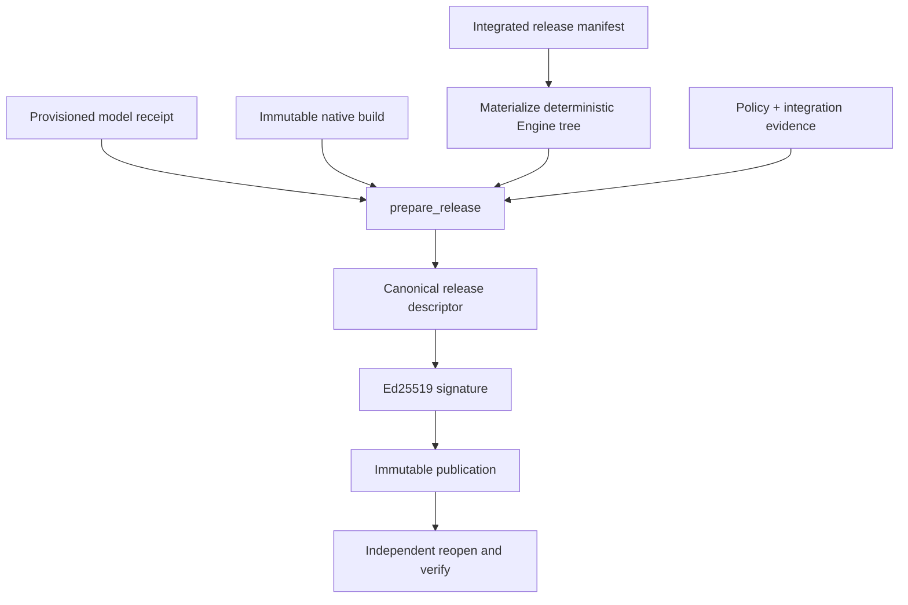

Release construction is a reviewed programmatic workflow. The public CLI
verifies releases and emits container contexts; it intentionally has no
`release-create` command that could collapse review, key access, and
publication into an ambient shell operation.

This is deliberate separation of duties. The builder may assemble and hash inputs without
possessing the private signing key. The signer may approve one descriptor without gaining
permission to mutate its artifacts. The publisher may stage a signed release without
deciding which public key consumers trust. The deployer starts only an independently
authorized registry digest.

## Roles and handoffs

| Role                         | Receives                                                 | Produces                                                          | Must not silently choose              |
| ---------------------------- | -------------------------------------------------------- | ----------------------------------------------------------------- | ------------------------------------- |
| Integration/release reviewer | Crown-linked review records and reviewed source          | Approved integrated refs and release composition                  | Signing key or deployment target      |
| Reproducible builder         | Frozen source/model/native/policy inputs                 | Canonical descriptor and deterministic artifacts                  | Different dependency/runtime versions |
| Release signer               | Reviewed descriptor digest and signing policy            | Ed25519 signature                                                 | New bytes after approval              |
| Publisher                    | Signed descriptor plus complete payload inventory        | Digest-addressed reopened publication                             | An embedded key as trust root         |
| Container publisher          | Verified context and target repository/platform          | Matching double-build digest and signed reproducibility statement | Mutable tag as final identity         |
| Deployment operator          | External public key, expected descriptors/digests, model | Authorized canary and retained receipts                           | Runtime repairs to a signed release   |

## Required inputs

Freeze and independently reopen:

- an integrated-only `EngineReleaseManifest`;
- one approved `IntegrationReviewRecord` for every active target;
- a deterministic Engine tree materialized from those integrated sources;
- the provisioned model and receipt;
- the native build specification and immutable native publication;
- reviewed seccomp, reference, and calibration manifests;
- the upstream repository and exact revision;
- the pinned SGLang version;
- a `ServeSpec` with digest-pinned base image, platform, model mount, TP size,
  canonical arguments, and bounded environment.

The serving specification cannot override validator-owned model or TP flags and
rejects dangerous environment keys.

## Construction sequence



The API handoff has this shape. The names on the right are already constructed
and independently reopened typed inputs; the release API does not discover them
from an ambient working directory:

```python
from optima.release import prepare_release, publish_release, sign_release

prepared = prepare_release(
    source_root=optima_source_root,
    release_manifest=release_manifest,
    engine_tree=materialized_engine_tree,
    integrations=integration_records,
    model_id=model_id,
    model_revision=model_revision,
    model_manifest_digest=model_manifest_digest,
    model_provision=provisioned_model,
    native_build_spec=native_build_spec,
    native_publication=native_publication,
    seccomp_payload=reviewed_seccomp_bytes,
    reference_manifest_payload=reference_manifest_bytes,
    calibration_manifest_payload=calibration_manifest_bytes,
    upstream_repository=upstream_repository,
    upstream_revision=upstream_revision,
    sglang_version=pinned_sglang_version,
    serve=serve_spec,
)

signature = sign_release(prepared.descriptor, offline_private_key_bytes)

published = publish_release(
    release_publication_root,
    prepared.descriptor,
    signature,
    materialized_engine_tree,
    prepared.payloads,
    prepared.native_publication,
    expected_public_key=independently_expected_public_key,
)
```

| Input group                              | Must already establish                                                                              |
| ---------------------------------------- | --------------------------------------------------------------------------------------------------- |
| Release manifest and integration records | Integrated-only active target set with exact review coverage                                        |
| Engine tree                              | Deterministic materialization whose stack digest equals the release manifest                        |
| Model provisioning                       | Exact path-independent regular-file inventory and approved model identities                         |
| Native build/publication                 | Build spec bound to the Engine tree and reopened architecture-specific artifacts                    |
| Reference/calibration/seccomp bytes      | Canonical reviewed policy objects, not caller-generated approximations                              |
| Upstream/SGLang/serve identities         | Exact revision, pin, base image, platform, model mount, TP size, arguments, and bounded environment |

Production code should keep construction, signing, and publication as separate
reviewed steps even when a test fixture performs them sequentially.

`prepare_release()` repeats the source/wheel build twice from the same frozen
source root and requires byte-for-byte reproducibility. It recomputes SBOM and provenance from typed
inputs, validates exact artifact roles, and returns a canonical descriptor plus
payloads. Native artifacts are bound to the exact Engine-tree build spec.

`sign_release()` signs the descriptor digest with a raw 32-byte Ed25519 private
key. Keep that key outside build inputs, logs, environment snapshots, and the
published tree. Publish the corresponding public key through a separate trust
channel.

`publish_release()` verifies the signature and reopens the descriptor-bound
release, Engine tree, native publication, and shipped artifact payloads before
staging the complete inventory. The retained license/provenance/security/
compatibility/test evidence objects are authenticated during promotion and
referenced by digest in each integration record; publication does not reopen
those external evidence objects. The published tree's regular files are frozen
read-only and it is atomically placed under the descriptor digest; reopen
verification detects any later directory-entry or byte mutation. Publication
is idempotent only when an existing tree reopens as the same release.

### Why every reopen happens again

Preparation, signing, publication, context creation, container authorization, and startup
are separate trust moments. A successful earlier check does not prove that the next actor
received the same bytes. Reopening at each handoff turns a copied digest into a verified
relationship:

```text
typed inputs -> descriptor -> signature -> publication -> context -> image -> container
      each arrow recomputes and compares the identity it consumes
```

This also localizes failure. A publication mismatch does not retroactively invalidate a
correct integration record; it blocks that publication. A registry mismatch does not
rewrite the signed descriptor; it blocks container authorization.

## Published inventory

```text
<descriptor-digest>/
├── release.json
├── release.sig.json
├── artifacts/
│   ├── runtime source distribution and wheel
│   ├── model provisioning receipt
│   ├── reviewed seccomp profile
│   ├── reference and calibration manifests
│   ├── SPDX SBOM
│   └── provenance statement
├── engine-tree/
└── native-artifacts/
```

The descriptor also embeds the complete release manifest, integration records,
model/native identities, upstream identities, and serving specification.

## Publication checklist

<Callout type="info" title="Implemented workflow, pending final operational proof">
  The typed release, registry, authorization, runtime, and receipt gates are implemented and covered
  by focused/full-suite tests. The current state of record does not claim an actual reproducible
  registry image pair followed by final TP8 serving and receipt verification.
</Callout>

- Rebuild from a clean, exact source revision.
- Require the current SGLang pin and compatible upstream revision.
- Verify every integrated source digest and exact review-record coverage;
  retained external review artifacts were authenticated during promotion.
- Use a digest-pinned base image; tags are not release identities.
- Confirm source and wheel reproducibility before signing.
- Keep the private key offline from the candidate and serving contexts.
- Verify the published tree using the externally distributed public key and
  expected descriptor digest.
- Record the descriptor digest as the release identifier; never use a mutable
  `latest` path as authority.

## Failure behavior

| Failure                                                         | Required response                                                 |
| --------------------------------------------------------------- | ----------------------------------------------------------------- |
| Missing or extra integration review                             | Reject release preparation; do not drop the unmatched target      |
| First and second source/wheel products differ                   | Stop and diagnose nondeterminism before signing                   |
| Native publication or model receipt no longer reopens           | Stop; recover the exact input or construct a new release identity |
| Signature verifies only with the key embedded in the release    | Untrusted until an externally obtained expected key verifies it   |
| Destination digest directory exists but differs                 | Treat as corruption/collision; never overwrite in place           |
| Two container builds produce different raw manifests            | Do not issue reproducibility authorization                        |
| Image verifies but host policy differs from signed `ServeSpec`  | Do not start the container                                        |
| Canary answers but receipts show fallback/missing rank coverage | Do not promote; responsiveness is not activation proof            |

An aborted release attempt leaves the previous signed publication authoritative. Repairing
inputs should create a newly prepared and signed descriptor, not a hand-edited release
directory.

Source: [`optima/release.py`](https://github.com/latent-to/optima/blob/main/optima/release.py).
