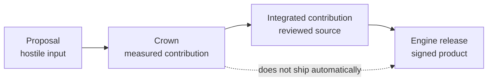

**Miner-fed · validator-proven · chain-independent**

# Build faster inference into a product.

Cacheon turns untrusted GPU optimization proposals into measured contributions and,
after a separate integration review, signed **Cacheon Engine** releases. SGLang keeps
the serving control plane. Cacheon improves the inference data plane.

- [Build a kernel](/docs/miners/overview)
- [Operate the referee](/docs/validators/overview)
- [Understand the architecture](/docs/architecture/overview)

At the highest level, Cacheon has two systems: the chain-independent product and
the market that improves it. Operationally, the market side separates the
subnet control plane from the hostile-code referee, giving readers three
cooperating surfaces with different trust boundaries.

| Surface                                        | What it is                                                                                                                    |
| ---------------------------------------------- | ----------------------------------------------------------------------------------------------------------------------------- |
| [**Cacheon Engine**](/docs/engine/overview)    | The chain-independent inference distribution: reviewed source, pinned runtime, sealed model identity, and signed releases.    |
| [**The referee**](/docs/architecture/pipeline) | Isolated, evidence-producing evaluation of one marginal target delta against a validator-owned incumbent stack.               |
| [**The subnet**](/docs/validators/chain-loop)  | Finalized proposal ordering, attribution, economic settlement, and weight publication. It is not part of the serving product. |

## One idea, four objects

The system keeps four objects deliberately separate:

A miner submits a **proposal** for one registered target delta, or a bounded discovery
prototype through the separate discovery ABI. The referee may establish a **crown**
after two independent passing qualifications. Cacheon maintainers may then turn the
proposal into an **integrated contribution** after security, provenance,
compatibility, and maintenance review. Only integrated contributions enter a signed
**Engine release**. Discovery has review, promotion, or bounded-bounty outcomes; it is
not another standing target family.

[Learn the product model →](/docs/architecture/product-model)

## Why the architecture is composable

Every candidate runs as a complete isolated engine, but it is rewarded only for the
smallest validator-controlled delta it contributes. The authoritative bracket compares:

- **B** — the exact incumbent evaluation stack;
- **C** — the same stack with one registered target replaced;
- **B′** — an independent incumbent bookend; and
- **T** — a candidate-free pristine reference that grades sealed trajectories after
  candidate destruction.

This separates the **execution unit** (a complete disposable engine) from the
**economic unit** (one singleton target, atomic target, or bounded discovery
contribution). A new optimization can build on previous wins without repackaging or
copying them.

[Follow a proposal through the system →](/docs/architecture/pipeline)

## Choose your path

| Goal                                                        | Start here                                         |
| ----------------------------------------------------------- | -------------------------------------------------- |
| Write a Triton, CuTeDSL, or Python reference kernel         | [Miner guide](/docs/miners/overview)               |
| Validate the repository locally without a GPU               | [Local quickstart](/docs/get-started/quickstart)   |
| Deploy intake, an arena provider, and qualification workers | [Validator guide](/docs/validators/overview)       |
| Verify or operate a signed serving artifact                 | [Cacheon Engine](/docs/engine/overview)            |
| Audit trust boundaries and failure behavior                 | [Security model](/docs/security/threat-model)      |
| Check what is implemented, measured, and still unproven     | [State of record](/docs/reference/state-of-record) |

## Evidence is scoped, not blended

Every performance or authority claim is scoped to the exact runtime, hardware, arena,
stack, identities, and procedure that produced it. Diagnostic measurements cannot
authorize a crown; crown evidence cannot authorize reviewed source; and release
verification cannot retroactively validate qualification. The
[state of record](/docs/reference/state-of-record) identifies which evidence products have
actually been retained for each boundary.

<Callout type="info" title="Source of executable truth">
  The [Cacheon source repository](https://github.com/latent-to/optima) owns executable contracts,
  schemas, policies, and evidence verifiers. Content-addressed production evidence and immutable
  publications live in separate operator-owned stores. This site owns published explanations,
  tutorials, and operator guidance. When prose and code disagree, the pinned code and its tests take
  precedence.
</Callout>
