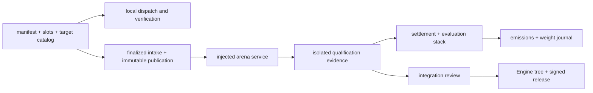

This map groups the Cacheon source by authority boundary. File names are links
to the current code repository; source remains authoritative when details
change.

## Read by authority, not import depth

The easiest way to get lost in Cacheon is to follow imports as though every
module had the same trust level. Start from the decision whose authority you
are trying to understand:

The left branch is useful to contributors but cannot crown anything. The upper
production branch owns hostile evaluation and economic state. The release
branch reopens evidence but accepts only reviewed integrated source.

## Contribution contract

| Area | Primary source |
|---|---|
| Bundle parsing and path rules | [`manifest.py`](https://github.com/latent-to/optima/blob/main/optima/manifest.py) |
| Slot ABI and trusted references | [`slots.py`](https://github.com/latent-to/optima/blob/main/optima/slots.py) |
| Target identity and composition | [`target_catalog.py`](https://github.com/latent-to/optima/blob/main/optima/target_catalog.py) |
| Typed tensor/output boundary | [`tensor_spec.py`](https://github.com/latent-to/optima/blob/main/optima/tensor_spec.py) |
| Static policy | [`sandbox.py`](https://github.com/latent-to/optima/blob/main/optima/sandbox.py) |
| Tracing-JIT admission (post-main snapshot) | `optima/dsl_jit_policy.py` |
| Local and distributed verification | [`verify.py`](https://github.com/latent-to/optima/blob/main/optima/verify.py), [`verify_collective.py`](https://github.com/latent-to/optima/blob/main/optima/verify_collective.py) |
| SGLang dispatch | [`dispatch.py`](https://github.com/latent-to/optima/blob/main/optima/dispatch.py), [`seams.py`](https://github.com/latent-to/optima/blob/main/optima/seams.py) |
| Scheduler-role candidate load (post-main snapshot) | `optima/seam.py`, `optima/integrations/sglang_scheduler_gate.py` |

## Intake and referee

| Area | Primary source |
|---|---|
| Chain-facing commands | [`cli.py`](https://github.com/latent-to/optima/blob/main/optima/cli.py) |
| Finalized intake and SQLite state | [`chain/intake.py`](https://github.com/latent-to/optima/blob/main/optima/chain/intake.py) |
| Hardened archive fetch | [`chain/fetch.py`](https://github.com/latent-to/optima/blob/main/optima/chain/fetch.py) |
| Validator loop | [`chain/validator_loop.py`](https://github.com/latent-to/optima/blob/main/optima/chain/validator_loop.py) |
| Injected arena boundary | [`arena_service.py`](https://github.com/latent-to/optima/blob/main/optima/arena_service.py) |
| Qualification schema and regrading | [`eval/qualification.py`](https://github.com/latent-to/optima/blob/main/optima/eval/qualification.py) |
| OCI lifecycle and protocol | [`eval/oci_backend.py`](https://github.com/latent-to/optima/blob/main/optima/eval/oci_backend.py), [`eval/oci_session_protocol.py`](https://github.com/latent-to/optima/blob/main/optima/eval/oci_session_protocol.py) |
| Host-owned B/C/B′ session | [`eval/oci_outer_session.py`](https://github.com/latent-to/optima/blob/main/optima/eval/oci_outer_session.py) |
| Immutable native prebuild | [`eval/oci_prebuild.py`](https://github.com/latent-to/optima/blob/main/optima/eval/oci_prebuild.py) |
| Device conditioning/cleanup | [`eval/device_state.py`](https://github.com/latent-to/optima/blob/main/optima/eval/device_state.py) |

## State, economics, and weights

| Area | Primary source |
|---|---|
| Evaluation/release stack identities | [`stack_manifest.py`](https://github.com/latent-to/optima/blob/main/optima/stack_manifest.py) |
| Transactional settlement state | [`chain/intake.py`](https://github.com/latent-to/optima/blob/main/optima/chain/intake.py) |
| Pure emissions projection | [`economics.py`](https://github.com/latent-to/optima/blob/main/optima/economics.py) |
| Weight publication reconciliation | [`chain/weights.py`](https://github.com/latent-to/optima/blob/main/optima/chain/weights.py) |
| Copy and attribution evidence | [`copy_fingerprint.py`](https://github.com/latent-to/optima/blob/main/optima/copy_fingerprint.py) |

## Engine integration and release

| Area | Primary source |
|---|---|
| Deterministic Engine tree | [`engine_tree.py`](https://github.com/latent-to/optima/blob/main/optima/engine_tree.py) |
| Model provisioning | [`model_provision.py`](https://github.com/latent-to/optima/blob/main/optima/model_provision.py) |
| Release evidence/signing/publication | [`release.py`](https://github.com/latent-to/optima/blob/main/optima/release.py) |
| Release runtime verification | [`release_runtime.py`](https://github.com/latent-to/optima/blob/main/optima/release_runtime.py) |
| Container host policy | [`release_host.py`](https://github.com/latent-to/optima/blob/main/optima/release_host.py) |

## Compatibility and discovery

| Area | Primary source |
|---|---|
| SGLang pin and canary | [`compat.py`](https://github.com/latent-to/optima/blob/main/optima/compat.py) |
| Bittensor SDK canary | [`chain_canary.py`](https://github.com/latent-to/optima/blob/main/optima/chain_canary.py) |
| Discovery policy and arm | [`discovery.py`](https://github.com/latent-to/optima/blob/main/optima/discovery.py) |
| Discovery overlay | [`discovery_overlay.py`](https://github.com/latent-to/optima/blob/main/optima/discovery_overlay.py) |

## Follow a concrete task

### “Why was this bundle rejected?”

Read in this order:

1. `manifest.py` for exact TOML shape and contained-path rules;
2. `sandbox.py` and `dep_policy.py` for observed source/build features;
3. `target_catalog.py` for target resolution and admitted features;
4. `slots.py` and `tensor_spec.py` for callable/output semantics; and
5. `verify.py` or `verify_collective.py` for executable correctness.

This ordering separates syntax, capability admission, ABI, and numerical
failure. They are different diagnoses even when the CLI reports them in one
run.

### “How did a finalized reveal become a crown?”

Start at `chain/intake.py`, then follow `chain/fetch.py` and
`chain/publication.py` into `chain/validator_loop.py`. The loop resolves the
closed `ArenaServiceRegistry`, receives screening and qualification work,
persists evidence references, and invokes transactional settlement. Read
`eval/qualification_runner.py` alongside `eval/qualification.py`: the runner
orchestrates work; the schema and regrader define what counts as authority.

The first matching PASS leaves reproduction pending. A second distinct,
matching PASS may settle the contribution and advance the evaluation stack.
Console output and evaluator summary text are never the settlement input.

### “Why did weight publication remain pending?”

Read `economics.py` first: it computes the pure global projection from reopened
active contribution state. Then read `chain/weights.py`: it refreshes the live
metagraph, journals intent before submission, records SDK results without
treating them as confirmation, and reconciles later chain observation.
`--dry-run` creates no journal intent, while reconciliation and submission have
different durable states.

### “What exactly ships?”

Follow `stack_manifest.py` into `engine_tree.py`, `model_provision.py`, and
`release.py`. The release manifest accepts only `IntegratedContributionRef`
objects. The selected payload remains bound to its crowned digest; later
materialization owns deterministic module namespaces and packaging. Finally,
`release_runtime.py` and `release_host.py` enforce consumer and host policy.

## State and evidence locations

| Object | Owner | Identity / persistence rule |
|---|---|---|
| Parsed bundle | Contributor/diagnostic process | Content hash over the admitted bundle tree |
| Finalized publication | Intake controller | Validator-owned immutable worker publication |
| Qualification evidence | External evidence root | Typed content-addressed artifacts reopened before grading/settlement |
| Evaluation stack | Referee state | Canonical manifest that may reference hostile proposals |
| Settlement and weight state | Chain-scoped SQLite controller | Transactional single-writer state plus intent/readback journal |
| Integrated source | Reviewed source control | Full reviewed commit plus selected-payload and attribution digests |
| Engine release | Release publication root | Descriptor-addressed signed tree reopened under an expected public key |

Paths are deliberately not identities. A local directory name, URL, database
row number, or registry tag cannot replace the corresponding digest-bound
object.

## Tests as executable maps

Tests mirror the authority boundaries rather than one monolithic integration
fixture:

- `test_static.py`, manifest tests, and `test_target_catalog.py` cover hostile
  input and target admission;
- `test_stack_manifest.py`, stack-planning tests, and `test_engine_tree.py`
  cover canonical composition and integration materialization;
- qualification, OCI, and reference-protocol tests cover the B/C/B′/T
  authority;
- chain-intake, settlement, economics, and weight-publication tests cover
  durable economic transitions; and
- release, runtime, registry, and host tests cover the signed serving boundary.

When learning a type, search for both its successful construction and its
rejection tests. The negative cases usually reveal which fields are security
inputs rather than descriptive metadata.

## Legacy and diagnostic paths

Some older simulator and direct-evaluation modules remain useful for tests and
development. In particular, `commit_reveal.py` and the local `commit`,
`reveal`, `ledger`, and `legacy-settle --development-only` commands do not back
the production SQLite controller. Likewise, `eval/_launch.py` and direct
`evaluate`/`bench` flows are not alternate qualification authorities. Start
from the validator loop and qualification runner when auditing production.

Tests are organized under `tests/` by the same boundaries. Contract tests are
often the clearest executable examples because they build exact typed objects
and assert fail-closed behavior.
