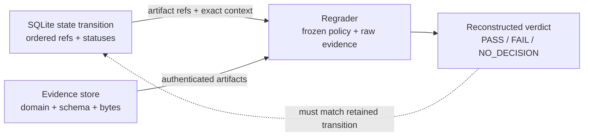

Cacheon retains raw, content-addressed evidence so a qualification decision can be
reopened and regraded. A summary score, log excerpt, or database flag is not sufficient
authority by itself.

The database and evidence store play complementary roles. SQLite says **which transition
was authorized, in what order, and which evidence addresses belong to it**. The evidence
store supplies **the authenticated bytes needed to recompute the decision**. Backing up
only one leaves either an unindexed pile of artifacts or an unreplayable state machine.

## Two durable layers

### SQLite authority

`FinalizedIntakeStore` records ordered state and references:

- chain scope, finalized cursor, and reservations;
- immutable proposal publication and copy disposition;
- arena screen attempts and receipts;
- qualification authority, outcomes, and reproduction state;
- settlement candidates, leases, events, and evaluation stacks;
- standing and discovery reward claims; and
- weight projections and publication journal records.

The database is the transactional index and state machine. Large semantic evidence bytes
belong in the separate evidence store.

### Content-addressed evidence store

Every `EvidenceArtifactRef` binds:

- domain;
- SHA-256;
- exact byte length;
- media type; and
- schema identifier.

The store requires a canonical absolute owner-only root, owner-only shard directories,
single-linked read-only files, size bounds, no symlinks, atomic publication, fsync, and a
stable digest check when reopening. Existing duplicate bytes are accepted; conflicting
bytes at the same address fail.

The default artifact limit is 64 MiB, with a hard 1 GiB ceiling. Individual evidence
producers may impose tighter bounds.

## Evidence chain

Authoritative qualification relates these products:

| Stage | Representative retained identity/evidence |
|---|---|
| Intake | Finalized block/event order, payload, committed hash, reservation, immutable publication |
| Stack construction | Target catalog, contribution ref, incumbent/candidate manifests, materialized trees, marginal arm/cohort plans |
| Arena | Service manifest, capacity decision, ordered screen-stage evidence and receipt |
| Launch | Runtime preflight, model mount, native build/publication, hardware/resource/seccomp identity |
| Execution | B/C/B′ raw session frames, prompt batches, token counts, timings, device-state and cleanup receipts |
| Graph | Member, variant, shape, capture, and replay observations |
| Selection | Pre-execution commitment, post-commit entropy, secret reveal, selected prompts, sealed trajectory digest |
| Reference | Candidate-free T request/transcript and teacher/hidden-task evidence |
| Calibration | Raw control evidence, context, frozen thresholds and metric policy |
| Qualification | Regraded candidate report and complete cohort attempt |
| Reproduction | Distinct authority, attempt, report, and selection evidence over the same economic identity |
| Settlement | Paired candidate, evidence references, hash-chained event plan, atomic stack transition |
| Weights | Exact global projection, intent/pending/held/confirmed records, live readback |
| Release | Integration records, model receipt, source/wheel, native inventory, SBOM, provenance, descriptor signature, OCI attestation, serve receipts |

Not every artifact is public. Selection secrets and hidden tasks remain in private
validator storage; serializable authority records contain references and commitments, not
the secret bytes.

## Reopening and regrading

A valid audit proceeds from identities, not from a desired verdict:

1. Reopen the chain-scoped reservation and immutable publication.
2. Reopen the exact target catalog, stack/tree, launch, model, and native identities.
3. Authenticate each evidence artifact by domain, schema, size, and digest.
4. Recompute charged execution rates from raw session batches.
5. Regrade graph observations against the frozen requirement.
6. Reconstruct selection and verify post-commit entropy and trajectory binding.
7. Verify T is candidate-free and covers the selected prompts/tasks.
8. Regrade quality and speed under the exact frozen calibration.
9. Reconstruct the qualification decision and reproduction identity.
10. Reopen settlement and reward claims before projecting weights.

Missing, changed, ambiguous, or context-mismatched evidence yields a hold or
`NO_DECISION`; it must not be patched over with an operator assertion.

### Example: reopening a disputed speed pass

A reviewer starts with the settlement candidate, not with a dashboard's reported
speedup. They reopen both qualification attempt references and verify that their
reproduction identities match but their authorities/evidence roots are distinct. For
each attempt they then:

1. recover the exact B/C/B′ raw batches and host timings;
2. verify token counts, charged intervals, role order, device-state, and cleanup receipts;
3. recompute B/B′ drift and candidate throughput under the frozen calibration;
4. reopen selection commitments and the sealed C trajectory;
5. verify the separate T lifetime is candidate-free and regrade quality;
6. reconstruct the attempt verdict; and
7. verify settlement used the lower accepted speedup and the exact live target transition.

If the dashboard rounded both attempts to “1.04×” but raw evidence reconstructs different
accepted values, the exact values and conservative settlement rule govern. If one raw
session artifact is gone, the reviewer cannot fill the gap from logs or the other pass;
the economic claim must be held according to policy.

## Failure semantics

| Problem discovered while reopening | Consequence |
|---|---|
| Artifact digest, length, domain, media type, or schema differs | Authentication failure; do not consume the bytes |
| Artifact exists but belongs to another arena/stack/attempt context | Context mismatch; it cannot repair this authority |
| Raw execution evidence is incomplete | No attributable reconstructed verdict; hold or `NO_DECISION` |
| Regraded result differs from stored verdict | Preserve both products, stop downstream transition, investigate policy/code/state integrity |
| Two passes reuse authority or evidence | Reproduction requirement is unsatisfied |
| Active claim's evidence was deleted | Hold reward projection; do not treat deletion as retirement |
| Release artifact fails reopen while crown evidence survives | Block that release/publication; historical crown authority is a separate state machine |

## Retention and recovery

The code authenticates evidence that exists; the operator owns retention policy and
disaster recovery. A production plan should define:

- evidence lifetime for active crowns, retired claims, disputes, and releases;
- SQLite-consistent backups plus evidence-store snapshots;
- restore tests that preserve file modes, ownership, single-link shape, and absolute root;
- capacity alerts and a policy for non-authoritative screen/debug logs;
- encryption and access control for private prompts, hidden tasks, model identity, and
  operational metadata; and
- deletion rules that prevent an active reward claim from outliving its reopenable
  authority.

Deleting evidence for an active crown is not harmless garbage collection: economics will
hold the projection when the claim can no longer reopen.

### Restore drill

A useful restore test uses a copy of the SQLite database and evidence root on a clean
owner-controlled path, then exercises the same reopen/regrade calls used by settlement and
weight projection. Verify not only digests, but also the filesystem assumptions enforced
by the evidence store: absolute root, owner-only directories, regular single-linked files,
read-only modes, and stable size/digest during access. A byte-perfect backup restored with
unsafe ownership or hard links should fail until the storage boundary is repaired.

## Privacy and observability

Retain the minimum data required by the registered policy. Do not place wallet secrets,
release private keys, cloud credentials, private worklogs, or unrelated user prompts in
evidence artifacts. Logs are useful for operations but should refer to content digests
instead of dumping candidate source, hidden work, or model data.

## Nonclaims

- Content addressing proves byte integrity, not semantic correctness.
- Regrading reproduces the implemented policy; it does not prove the policy was well
  chosen.
- Local retention does not provide cross-validator consensus or public availability.
- A database administrator or host root can still destroy or replace the entire authority
  domain; backups, access control, and independent audit remain operational requirements.

## Source anchors

- [Evidence store](https://github.com/latent-to/optima/blob/main/optima/eval/evidence_store.py)
- [Calibration evidence](https://github.com/latent-to/optima/blob/main/optima/eval/calibration.py)
- [Qualification evidence model](https://github.com/latent-to/optima/blob/main/optima/eval/qualification.py)
- [Qualification runner and regrade](https://github.com/latent-to/optima/blob/main/optima/eval/qualification_runner.py)
- [SQLite authority](https://github.com/latent-to/optima/blob/main/optima/chain/intake.py)
