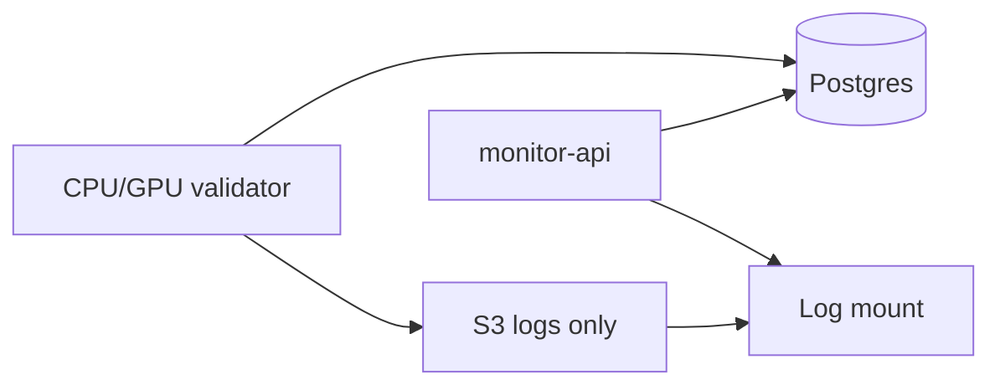

## Validator main loop

The CPU validator loop lives in `validator/cpu_validator.py`. Operators usually run it through Docker Compose `validator/docker-compose.yml`, using the image built from `validator/Dockerfile.cpu`. Alternatively you can also run it directly on the host with `python -m validator.cpu_validator` while using the same environment variables and mounts.

Between ticks, the process sleeps for `poll_interval`, configured through `CACHEON_POLL_INTERVAL_S` or `--poll-interval`. The bundled Compose setup defaults to `600` seconds when that variable is unset.

```py
while True:
    reload_state_from_postgres()
    sync_logs_from_s3()  # logs/ and container_logs/ only

    metagraph, block, block_hash = scan_chain()
    commitments = parse_commitments(metagraph)
    commitments = gate_unpaid_commitments(state, commitments)  # verify payment_tx on-chain

    if leader_hotkey_deregistered():
        promote_runner_up_or_clear()

    challengers = select_unevaluated(commitments)
    if challengers:
        mirror_eval_job_to_postgres(challengers, block, block_hash)

        if gpu_eval_configured():
            gpu = search_providers(targon, lium, shadeform)
            pod = rent_once(gpu)              # first challenger round
            ssh_exec(pod, setup-gpu.sh)     # once per validator container
            ssh_exec(pod, gpu-compose up)   # each eval round; same pod
            teardown(pod)                   # validator container shutdown
            reload_state_from_postgres()
            sync_logs_from_s3()

    metagraph, block, _ = scan_chain()  # fresh read before weights
    if leader_hotkey_deregistered():
        promote_runner_up_or_clear()

    if new_eval_results() or weights_stale():
        set_weights(leader, runner_up)

    sleep(poll_interval)
```

Weight setting triggers in three situations:

- **New eval results**: GPU completed evaluations (detected by comparing `evaluation_block` against `last_weights_set_block`)
- **First weight set**: a leader exists but weights have never been set
- **Staleness refresh**: weights are older than one tempo (~360 blocks, ~72 min) to stay active in consensus

## GPU eval entrypoint

The GPU host runs `validator/gpu_eval.py` as a one-shot job, usually from the image built by `validator/Dockerfile.gpu` and started with `validator/gpu-compose.yml`. Docker Compose mounts the host Docker socket so the runner can start baseline and miner containers for each challenger (`evaluate_in_docker` in the pseudocode below). This component has no Bittensor dependency.

```py
state = load_state_from_postgres()
eval_job = load_pending_eval_job()
prompts = sample_prompts(block_hash)
baseline = run_baseline_if_needed(prompts)

# Leader and runner-up are re-evaluated first, then challengers.
# All scores in a round are fresh; no cached score carries forward.
for entry in eval_job.incumbents + eval_job.challengers:
    result = evaluate_in_docker(entry, prompts, baseline)
    state.record_evaluation(result)  # mirrors each eval to Postgres

state.rerank_round()   # pick leader and runner-up from this round's scores
mirror_validator_state_to_postgres()
upload_eval_logs_to_s3()
exit
```

The GPU loads the pending eval job and validator state from Postgres, runs evaluations, mirrors each result and progress update to Postgres, and uploads log artifacts to S3 on completion.

## State: Postgres + log artifacts

Structured state (evaluations, leader, eval jobs, eval progress, fingerprints, leader history) lives in **Postgres** only.

**S3** (`validator/sync.py`) syncs log artifacts only: `logs/` and `container_logs/` between the GPU pod and CPU validator mount.

Typical layout under `state-mainnet/`:

```
state-mainnet/
  container_logs/
    baseline_{hash}.log
    uid{N}_{hotkey}_{block}.log
  logs/
    gpu_eval_{timestamp}.log
```

Field-level shapes for Postgres tables and legacy JSON backfill: [Data contracts](/docs/evaluation/data-contracts).

## Observability

Each GPU eval run captures:

- **Per-prompt metrics**: TTFT (telemetry), end-to-end time (`e2e_s`), token match rate, output token count for every scored prompt
- **Container logs**: full stdout/stderr from baseline and miner containers, saved to `container_logs/`
- **Timestamped validator logs**: one log file per GPU eval session under `logs/`

Log artifacts are uploaded to S3. Structured fields mirror to **Postgres** on each write. The monitoring API reads Postgres for status, leader, evaluations, rounds, and eval progress; log blobs come from the local state mount (synced from S3).


