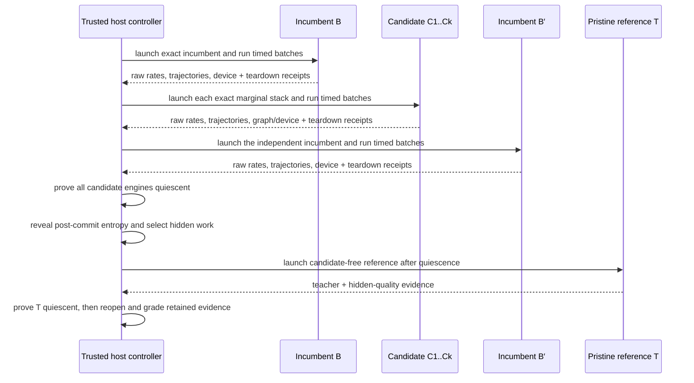

Qualification asks a narrow question: does one exact submitted delta improve one frozen
evaluation stack, in one registered arena, at acceptable quality?

The production answer comes from a causal B/C/B′/T protocol executed by a trusted host
controller. It does not come from a local diagnostic launch, an in-engine self-audit, a
miner report, or an arbitrary evaluator command.

## Identities before execution

Before a candidate runs, the validator binds:

- finalized reservation and hotkey;
- arena service and workload;
- target catalog and exact singleton or atomic target;
- submitted-delta digest;
- incumbent and candidate `EvaluationStackManifest` digests;
- materialized engine-tree and launch identities;
- model, runtime, topology, native build, seccomp, and worker distribution;
- calibration policy and graph-verification requirements; and
- selection commitment, private selection secret reference, and candidate order.

For a registered candidate, C is the incumbent stack with exactly one target replaced.
Every other contribution, adapter, fallback, and engine setting is supplied by the
validator. Discovery uses its separate prepared overlay identity and cannot install an
evaluation-stack manifest merely by passing.

There are three nested identities to keep straight:

| Identity                | What it fixes                                                                                   | Why it matters                                                      |
| ----------------------- | ----------------------------------------------------------------------------------------------- | ------------------------------------------------------------------- |
| Reservation             | Finalized arrival, hotkey, publication, target members, submitted delta                         | Prevents a later file tree or miner from inheriting the attempt     |
| Qualification authority | Frozen source/plan, candidate order, selection commitment, arena/calibration/runtime identities | Prevents the evaluator from changing the experiment after admission |
| Reproduction identity   | Arena, target, delta, hotkey, and exact incumbent/candidate stack and tree digests              | Defines what the second independent PASS must reproduce             |

Paths are not identities. Moving the same publication or evidence store does not change
the content digests, while rebuilding “equivalent” source under new bytes does.

## The four logical arms

| Arm | Purpose                                                | Trust status                                                       |
| --- | ------------------------------------------------------ | ------------------------------------------------------------------ |
| B   | First independent launch of the exact frozen incumbent | Timed isolated engine; may contain hostile incumbent contributions |
| C   | Same stack with one exact candidate delta              | Timed isolated engine; hostile                                     |
| B′  | Second independent incumbent launch                    | Timed isolated engine; may contain hostile incumbent contributions |
| T   | Candidate-free pristine reference                      | Untimed quality authority; no proposal contributions               |

B and B′ measure drift around C. The host owns role assignment, timers, protocol frames,
device checks, deadlines, and teardown. A candidate engine never chooses which role it is
playing and never becomes the quality oracle.

After C is destroyed, T teacher-forces the sealed B/C/B′ trajectories and performs the
registered hidden quality work. This ordering matters: candidate state is absent from the
reference lifetime, and an untrusted B′ is not silently treated as ground truth.

## Causal timeline and timing ownership

The controller executes the complete lifecycle under an exclusive engine transaction:

Only B, C, and B′ contribute charged serving rates. T is intentionally untimed: it is a
quality authority, not a competitor in the throughput ratio. The trusted controller owns
monotonic clocks, token numerators, conditioning windows, role order, absolute deadline,
device observations, and teardown. Candidate wall-clock reports and aggregate throughput
are ignored.

Two causal boundaries are retained. Pre-T quiescence must occur after B′ completion;
selection entropy is observed after that quiescence; T must start after entropy and finish
before post-T quiescence. Violating any boundary invalidates authority rather than being
rounded into a slower candidate score.

## Cohorts and selection

A service may freeze one incumbent and qualify a chain-ordered cohort `C1..Ck`, sharing
bookends and one pristine reference lifetime where the policy permits. This is an
operational optimization, not a semantic relaxation:

- every C remains one exact marginal delta;
- candidate ordering is sealed in finalized cohort/plan order before entropy is observed;
- post-commit entropy selects the hidden prompt/task work, and the selection receipt binds
  that choice without reordering candidates;
- drift outside calibration produces `NO_DECISION`; and
- retained evidence must still support each candidate independently.

The contract does not require four cold model loads per chain reveal. It requires the
evidence represented by the four arms to remain causally and cryptographically separable.

For registered cohorts, a recognized cohort-level factory, runner, raw-speed,
outer-session, or OCI-backend failure that the intake boundary normalizes into a
qualification failure product produces `NO_DECISION` for every affected reservation and a
persisted bisection plan. Subsequent passes halve the cohort to isolate a poisoning or
resource-sensitive candidate in logarithmic retry groups. A per-candidate `NO_DECISION` after a complete shared attempt is requeued individually. Other provider, controller, or
evidence-publication exceptions abort the pass and recover through controller
restart/hold handling rather than this typed batch product. Neither mechanism changes
finalized arrival order.

## Gates and three-way decisions

Qualification reopens and grades several evidence products:

1. **Execution:** required roles completed under the expected launch and device state.
2. **Graph verification:** required target members, variants, shapes, capture, and replay
   have complete evidence.
3. **Speed:** C beats the calibrated B/B′ bracket and noise-derived bar.
4. **Quality:** pristine T validates sealed trajectories and hidden work under the
   registered calibration.
5. **Whole-stack identity:** the report still describes the frozen incumbent and exact
   candidate stack.

The result is one of:

- `PASS` — all required evidence is complete and green;
- `FAIL` — attributable candidate evidence violates a registered requirement; or
- `NO_DECISION` — infrastructure, drift, missing authority, or incomplete evidence makes
  a fair result impossible.

`NO_DECISION` is retryable under bounded policy. It is not a loss and must not be
converted to zero reward for convenience.

The evidence-to-verdict mapping is fail closed:

| Observation                                                                                   | Decision      | Example                                                            |
| --------------------------------------------------------------------------------------------- | ------------- | ------------------------------------------------------------------ |
| Complete, bound, and green across every required product                                      | `PASS`        | C clears calibrated speed bar; graph and pristine quality pass     |
| Complete attributable violation of a frozen candidate requirement                             | `FAIL`        | Wrong output, graph replay failure, or measured quality regression |
| Authority incomplete, stale, unreopenable, too noisy, timed out, or infrastructurally invalid | `NO_DECISION` | Missing evidence bytes, baseline drift, controller/worker failure  |

An unexpected exception is not evidence of candidate guilt. The intake projection turns
recognized plan, runner, and raw-speed authority failures into typed failure products and
retry plans. Other controller exceptions are contained by the pass loop and recovered
conservatively on restart.

## Independent reproduction

One passing qualification is persisted as `reproduction_pending`. Settlement requires a
second passing qualification that matches:

- arena, target, selected delta, and hotkey;
- incumbent and candidate stack/tree identities; and
- reproduction identity.

It must differ in qualification authority, attempt evidence, report, and selection
evidence. Reusing the first attempt under a new filename is rejected. Settlement uses the
lower of the two measured speedups.

More precisely, the pair must keep the contribution identity equal while all seven
independence fields differ:

| Must match                                          | Must differ                        |
| --------------------------------------------------- | ---------------------------------- |
| Lane, arena, reservation and finalized order        | Qualification authority digest     |
| Hotkey, target, members, selected delta             | Qualification plan digest          |
| Arm and incumbent/candidate stack + tree digests    | Attempt artifact digest            |
| Incumbent and candidate manifests (registered lane) | Qualification report digest        |
| Discovery proposal identity (discovery lane)        | Selection commitment digest        |
|                                                     | Selection-secret commitment digest |
|                                                     | Selection evidence digest          |

"Independent" in this state-machine contract means those seven digest distinctions. The
schema does not attest that the attempts used different operators, hosts, organizations,
or infrastructure failure domains; a deployment that requires those properties must bind
and audit them separately.

After the first PASS, the same reservation goes through the five non-crown screens again
in the reproduction lane. Only the second PASS creates a `SettlementCandidate`. Before
settlement, the store requires exactly two retained qualification rows, reopens both
attempt references from their recorded store roots, confirms both dispositions still
carry PASS authority, and binds a new
settlement-evidence receipt. The slower passing speedup is used even if the primary was
faster.

## Reopen and regrade

Full regrade requires more than the persisted attempt reference. The caller must
reconstruct the exact `CausalQualificationInput`, including prepared plans, candidate
authorities, graph/calibration references and requirements, runtime policy, reference
authority, and commitment. SQLite's authority manifest and `CohortQualificationAttempt`
bind identities but do not embed that complete private provider/plan object. Settlement
restart authenticates attempt bytes and stored PASS dispositions; it does not invoke the
full causal regrader.

The final report is derived from the serialized attempt, referenced graph/quality
artifacts, and calibration manifests. Reopen can regrade graph and raw quality evidence.
Speed regrading uses the retained `SpeedWitness`: three aggregate B/C/B′
`ChargedExecutionRate` rows containing launch/session identities and
conditioning/timed/charged token counts and intervals. It recomputes rates and the frozen
speed decision from those aggregates; it does not reconstruct them from raw session
frames. A summary JSON line without these typed products is not authority.

See [Evidence and replay](/docs/security/evidence) for retention and audit requirements.

An authoritative attempt is not one headline. Durable authority includes the authority
manifest; selected plan and commitment/entropy/selection receipts; referenced graph or
discovery-execution evidence; the aggregate speed witness; the pristine-T execution
witness and raw quality artifact/binding; per-candidate reports; and the enclosing attempt
artifact. Settlement keeps references to both attempt roots.

The live outer session validates richer B/C/B′ protocol frames, lifecycle order, device
state, and cleanup before constructing that attempt. Those raw frames and per-arm device
samples are not serialized into `CohortQualificationAttempt`. The aggregate speed witness
must not be documented as raw batch retention or as proof that a later audit can replay the
original timing frames.

Reopening verifies hashes and expected bindings before grading. If the attempt artifact
reopens but a referenced graph, calibration, or raw quality product does not, authority is
still incomplete. Operators must retain every referenced evidence-store object and test
restores, not merely archive the final report digest. If policy requires raw B/C/B′ frame
replay, the attempt schema must first be extended to retain and bind those products.

## Qualification incident handling

| Incident                                                                             | Required disposition                                                                                                                                     |
| ------------------------------------------------------------------------------------ | -------------------------------------------------------------------------------------------------------------------------------------------------------- |
| Candidate engine exceeds deadline or violates protocol with attributable evidence    | Grade under the frozen requirement; `FAIL` only when attribution is complete                                                                             |
| Recognized worker, Docker, GPU, driver, plan, runner, or raw-speed authority failure | `NO_DECISION`; repair infrastructure and use bounded retry                                                                                               |
| Evidence-store publication failure                                                   | Abort the pass; recovery holds an interrupted `qualifying` row as `controller_restart_during_qualifying` rather than manufacturing a typed `NO_DECISION` |
| B/B′ drift exceeds calibration                                                       | `NO_DECISION`; do not increase the candidate's denominator or tune the bar after seeing C                                                                |
| Candidate survives past the pre-T quiescence proof                                   | Abort authority; never launch T into the contaminated lifetime                                                                                           |
| T identity/session mismatch                                                          | `NO_DECISION`; T cannot be replaced with B′ or a candidate-side audit                                                                                     |
| One member poisons a registered cohort                                               | Preserve cohort failure digest and execute the stored bisection groups                                                                                    |
| First PASS evidence root lost                                                        | No reproduction or settlement; restore exact bytes or hold                                                                                                |
| Reproduction differs in contribution identity or reuses any independence digest      | Reject the pair; it is not an independent reproduction                                                                                                    |

Never rerun only the favorable arm, splice evidence from different authorities, or lower
a threshold after seeing the outcome. A fresh attempt must be a complete, newly bound
qualification under the registered policy.

## Nonclaims

- Passing proves the registered arena/workload and policy, not universal model quality or
  performance.
- T is an independent semantic reference, not proof that the reference implementation is
  bug-free.
- Isolation and protocol checks reduce candidate influence; they are not a formal proof
  against GPU, driver, kernel, or container-runtime compromise.
- A crown records measurement and attribution. It does not satisfy integration, license,
  provenance, maintainability, or release review.
- Deployment must supply a reviewed production provider that constructs this work for the
  registered arena. Structural two-PASS fixtures can test the authority path but cannot
  establish an empirical GPU crown or production calibration.

Next: [Settlement and weights](/docs/validators/settlement-and-weights).

## Source anchors

- [Qualification evidence model](https://github.com/latent-to/optima/blob/main/optima/eval/qualification.py)
- [Causal qualification runner](https://github.com/latent-to/optima/blob/main/optima/eval/qualification_runner.py)
- [Finalized-intake projection](https://github.com/latent-to/optima/blob/main/optima/eval/qualification_intake.py)
- [Pristine reference session](https://github.com/latent-to/optima/blob/main/optima/eval/oci_reference_session.py)
- [Qualification tests](https://github.com/latent-to/optima/blob/main/tests/test_qualification_runner.py)
