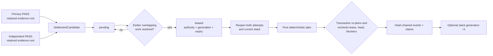
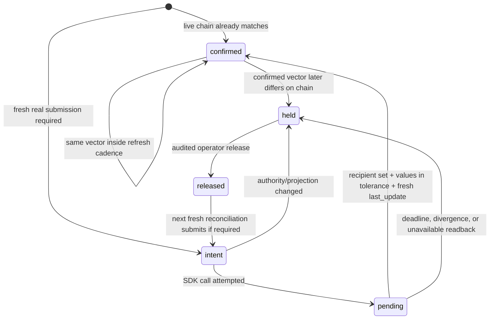

Settlement changes the evaluation incumbent. Weight publication projects settled reward
claims onto the live metagraph. They are separate operations with separate authority.

`chain-validate` may perform settlement when a trusted arena service is injected, but it
never opens a wallet or calls `set_weights`. The public `optima set-weights` command is the
control-plane reconciler.

The separation prevents a long-running evaluator from becoming a signer and prevents a
chain SDK return value from mutating evaluation-stack authority. Both operations use the
same exclusive SQLite store at different times, so deployment must coordinate ownership:
finish or pause a validator pass, run the signer reconciliation, close the store, and
resume. A lock collision is a control-plane scheduling error, not a reason to remove the
lock file.

## Settlement inputs

`SettlementCandidate` requires two complete passing qualifications:

- a primary attempt; and
- an independent reproduction of the same arena, target, delta, hotkey, incumbent, and
  challenger identity.

The attempts must use distinct qualification authority and evidence. The candidate's
settlement speedup is the lower of the two measured speedups.

Settlement planning is pure: it receives typed candidates plus the exact current
`EvaluationStackManifest` and tree digest. It reads no database, chain, wallet, or mutable
host state.

## From two PASSes to one atomic commit



The store chooses the oldest economically unblocked group sharing one qualification
authority. Earlier unresolved reservations that overlap the candidate's target members
remain blockers; a later fast result cannot jump them. The default lease is 30 blocks.
Expiry returns it to pending with a higher lease generation, preventing a worker holding
the old lease from committing.

Immediately before commit, the controller refreshes the finalized clock. Inside the
transaction the store verifies that the lease has not expired, the incumbent stack and
event-journal head have not advanced, economic blockers have not changed, both retained
evidence products are still byte-identical, and the plan exactly equals a freshly
recomputed plan. Any disagreement aborts the transaction.

## Deterministic plan

Candidates naming an older incumbent are held as `stale_incumbent`. Discovery candidates
produce bounty events without changing the stack. Among current registered candidates,
the planner chooses the highest conservative speedup and uses finalized order as a stable
tie-break.

The hash-chained event journal can contain:

| Event | Meaning |
|---|---|
| `HOLD` | Candidate cannot advance against this incumbent or lost a conflict |
| `CROWN` | Passing marginal contribution is recognized |
| `RETIREMENT` | Previous contribution at the target is superseded |
| `NEUTRALIZATION` | An overlapping target is displaced by explicit catalog policy |
| `ADOPTION` | New contribution is inserted into the evaluation stack |
| `STACK_TRANSITION` | Incumbent stack/tree advances atomically |
| `DISCOVERY_BOUNTY` | Qualified discovery receives bounded bounty treatment only |

The SQLite store leases an economically unblocked cohort, reopens the exact evidence and
current stack, and applies the event journal, stack transition, candidate dispositions,
standing claims, and discovery claims in one transaction. A failed transaction does not
partially crown a candidate.

The event journal is append-only and digest chained. Event types have distinct jobs:

- `CROWN` recognizes the winning measured contribution and creates the active standing
  claim for its registered target.
- `RETIREMENT` deactivates the previous claim for the same target.
- `NEUTRALIZATION` deactivates explicitly overlapping target families according to the
  catalog, not manifest order.
- `ADOPTION` and `STACK_TRANSITION` record the exact new evaluation manifest/tree and
  advance its generation together.
- `HOLD` records a stale-incumbent candidate or a deterministic conflict loser without
  mutating the stack.
- `DISCOVERY_BOUNTY` creates only the bounded discovery claim; it has no stack transition.

Do not infer event meaning from a miner bundle name or the final row status. Reopen the
event, candidate pair, evidence receipt, and resulting stack state as one authority.

## Standing reward families

Every active registered target defines one family. A singleton target owns its slot; an
atomic target owns its complete member set and suppresses explicitly overlapping
singleton families while active.

Credit comes from independently reproduced marginal improvement, expressed in integer
parts per million:

```text
improvement = speedup_ppm - 1_000_000
credit      = floor(improvement * half_life_blocks
                    / (half_life_blocks + age_blocks))
```

This reciprocal decay reaches half the original credit after one half-life. Retired or
neutralized contributions receive no standing credit. Engine-stack packaging,
integration, and release do not create additional reward families.

## Discovery bounties

Discovery does not install an evaluation stack entry. A qualifying discovery may create
one non-renewable claim with a bounded lifetime. All live discovery claims share a policy
pool measured in ppm; standing families receive the remaining pool. Repackaging,
promotion, integration, or release cannot renew the same bounty.

## Global projection

The reward builder reopens every active arena stack and every required standing claim,
then binds:

- chain genesis scope and netuid;
- validator hotkey;
- policy digest;
- effective block and block hash;
- current metagraph membership;
- arena stack generations and evidence; and
- an exact, positive integer-ppm vector totaling 1,000,000.

If an active family is stale, incompatible, missing, unreopenable, or assigned to a
hotkey absent from the metagraph, the complete projection is held. Its share is never
silently redistributed.

Projection is global across every retained arena, not “one `set-weights` call per
target.” The builder requires a catalog for every evaluation stack, reopens the evidence
behind every active standing and discovery claim, binds the emissions-policy digest on
first successful construction, and refuses a later policy change against the same
authority. Numeric policy arguments are required operator/validator-set configuration;
they are not hidden defaults or empirically calibrated by the code.

## Dry run

Use the same policy values intended for the deployment:

```bash
optima set-weights \
  --intake-db chain_intake/intake.sqlite3 \
  --netuid <NETUID> \
  --network <NETWORK_OR_WSS_URL> \
  --wallet default \
  --hotkey validator \
  --half-life-blocks <BLOCKS> \
  --discovery-lifetime-blocks <BLOCKS> \
  --discovery-pool-ppm <PPM> \
  --refresh-blocks <BLOCKS> \
  --dry-run
```

Dry run refreshes the live metagraph and exercises projection/reconciliation, but it does
not pass a wallet to the reconciler, sign or submit an extrinsic, or create a publication
journal intent. A real submission requires at least one genuine current-schema crown.

## Publication journal

Real publication is fail-closed and journaled:

| State | Meaning |
|---|---|
| `intent` | Exact projection persisted before the SDK call |
| `pending` | Submission attempted, but authoritative chain confirmation is absent |
| `confirmed` | The exact recipient set, normalized values within the fixed verifier tolerance, and a sufficiently new `last_update` were read back |
| `held` | Authority changed, deadline expired, readback diverged, or post-submit state is unavailable |
| `released` | Operator appended an audited release of a retained hold |

An SDK return value—even `submitted=True`—is not confirmation. The reconciler refreshes
the metagraph immediately, maps recipients to current UIDs, reads current validator
weights, persists intent before signing, and confirms only when the chain has
the exact recipient set, each normalized value is within the fixed
`2e-5` relative/absolute verifier tolerance, and `last_update` is new enough.

The normal state transitions are:



`pending` is a valid unresolved result, not success. Before its retry block, another run
only observes it. At or after the deadline, absent matching readback becomes `held` rather
than blindly resubmitting. If an unresolved record belongs to a different newly computed
projection, that conflict also becomes held.

The reconciler can record a preexisting chain match as `confirmed` without submitting.
Conversely, it refuses a real submission when `crown_count` is zero, when the wallet
hotkey differs from the projection authority, or when the effective metagraph/block is
already stale.

If the journal is held, investigate and preserve the record. To append an audited release
without submitting:

```bash
optima set-weights \
  --intake-db chain_intake/intake.sqlite3 \
  --netuid <NETUID> \
  --network <NETWORK_OR_WSS_URL> \
  --wallet default \
  --hotkey validator \
  --half-life-blocks <BLOCKS> \
  --discovery-lifetime-blocks <BLOCKS> \
  --discovery-pool-ppm <PPM> \
  --refresh-blocks <BLOCKS> \
  --release-hold "reviewed reason"
```

Then run the normal command again so it refreshes all live authority. `--release-hold`
cannot be combined with `--dry-run`.

Releasing a hold does not approve the old vector or submit it. It appends a `released`
record with the operator reason. The next normal invocation rebuilds and refreshes all
authority before deciding whether a new intent is valid.

## Failure and recovery matrix

| Condition | Safe outcome | Recovery |
|---|---|---|
| Earlier overlapping reservation unresolved | Candidate remains settlement-pending | Resolve earlier finalized work; do not reorder or delete it |
| Candidate names old incumbent | `HOLD` event / stale-incumbent disposition | A fresh qualification must target the current stack |
| Lease expires or store/journal head advances | Commit aborts; expired lease returns pending | Reopen authority and obtain a new lease generation |
| Either PASS evidence root cannot reopen | No settlement and no reward projection | Restore exact content-addressed bytes or retain hold |
| Transaction fails mid-plan | SQLite rollback; no partial events/claims/stack | Diagnose, then rerun against unchanged authority |
| Active claim hotkey leaves metagraph | Entire projection refused | Resolve validator-set policy; never redistribute implicitly |
| SDK says submitted, readback absent | `pending`, then `held` at deadline | Inspect chain/extrinsic; preserve journal and append reviewed release if appropriate |
| Post-submit chain authority unavailable | Immediate `held` | Restore authoritative reads before release/retry |
| Previously confirmed vector changes | `held` | Treat as an incident; compare chain history and signer activity |
| Emissions parameters differ from bound policy | Projection refused | Use the consensus-approved bound policy or migrate authority explicitly |

The journal and settlement tables are evidence. Back them up with SQLite-aware tooling,
monitor WAL/disk health, and test restoration with evidence roots present. Never repair an
incident by editing rows, resetting stack generation, deleting the publication head, or
constructing replacement evidence from summaries.

## Operations rules

- Run one signer for a given validator/database authority.
- Schedule signer ownership between validator passes; both processes intentionally fail
  if they try to own the database simultaneously.
- Protect the hotkey and wallet store; evaluator containers never receive them.
- Alert on `pending` age, `held` state, readback divergence, missing families, and
  metagraph churn.
- Do not bypass a hold by deleting journal rows or editing the projection.
- Coordinate emissions-policy parameters across the validator set; they are consensus
  configuration, not miner input.

## Source anchors

- [Settlement planner](https://github.com/latent-to/optima/blob/main/optima/settlement.py)
- [Transactional store application](https://github.com/latent-to/optima/blob/main/optima/chain/intake.py)
- [Emissions projection](https://github.com/latent-to/optima/blob/main/optima/economics.py)
- [Weight reconciler](https://github.com/latent-to/optima/blob/main/optima/chain/weights.py)
- [Emissions policy contract](https://github.com/latent-to/optima/blob/main/docs/EMISSIONS_POLICY.md)
